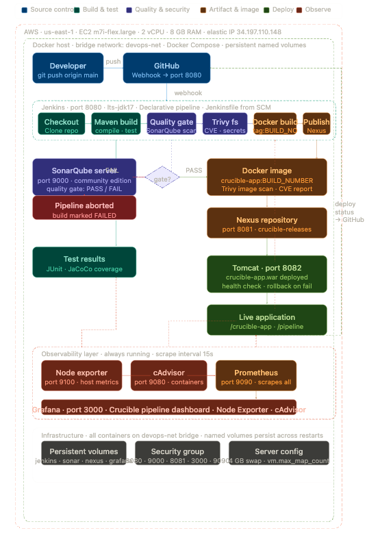

# Crucible

> An enterprise-grade CI/CD pipeline that takes a Java web application from code commit to production deployment — automatically, reliably, and with full quality enforcement.

## Live endpoints

| Service | URL |
|---------|-----|
| Application | http://34.197.110.148:8082/crucible-app |
| Jenkins | http://34.197.110.148:8080 |
| SonarQube | http://34.197.110.148:9000 |
| Nexus | http://34.197.110.148:8081 |
| Grafana | http://34.197.110.148:3000 |
| Prometheus | http://34.197.110.148:9090 |

## What this project does

Every push to `main` triggers a fully automated pipeline that:

1. Compiles and unit-tests the application with Maven
2. Runs a SonarQube code quality gate — pipeline fails if standards aren't met
3. Scans for CVEs and secrets with Trivy
4. Publishes the versioned artifact to Nexus Repository
5. Builds and scans a Docker image
6. Deploys to Tomcat with health check verification
7. Reports pipeline metrics to a Prometheus + Grafana dashboard

## Stack

| Tool | Role |
|------|------|
| Jenkins | Pipeline orchestration |
| Maven | Build and dependency management |
| SonarQube | Code quality and coverage gate |
| Trivy | Container and filesystem security scanning |
| Nexus | Artifact and Docker image repository |
| Docker | Application containerisation |
| Tomcat | Deployment target |
| Prometheus | Metrics collection |
| Grafana | Observability dashboards |

## Architecture



## Running locally

```bash
cd app
mvn clean package -DskipTests
java -jar target/crucible-app.war
```

## Pipeline

The full pipeline is defined in `jenkins/Jenkinsfile`.
# Crucible — CI/CD Pipeline
# Crucible — CI/CD Pipeline
