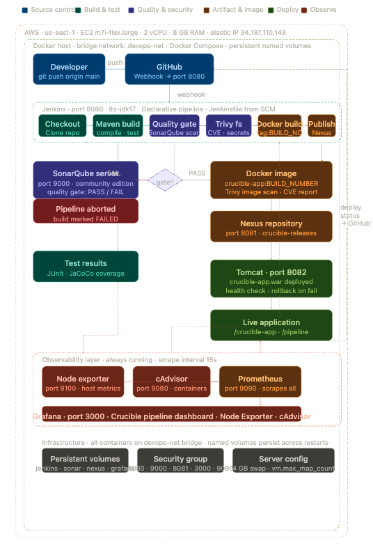
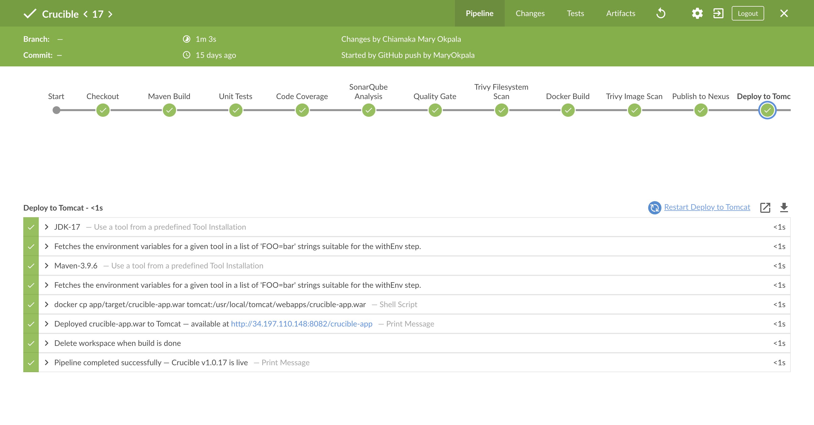
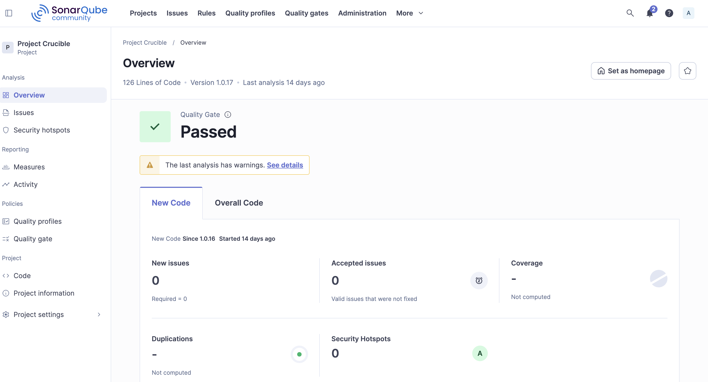
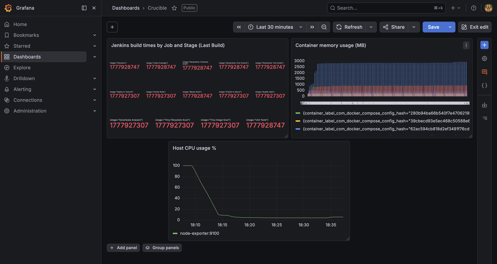
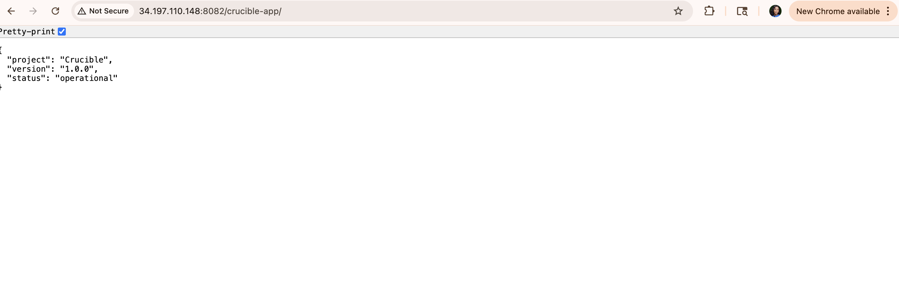

# Crucible

> An enterprise-grade CI/CD pipeline that takes a Java application from code commit to live deployment — automatically, reliably, and with security checks at every stage.

---

## The problem I set out to solve

Most developers have experienced the frustration of a deployment that works on one machine but breaks on another. Or a security vulnerability that slipped into production because nobody ran a scan. Or a build that passed tests but never actually got deployed because someone forgot to run the script.

I built Crucible to solve all of that at once. Not by adding more manual steps — but by removing every manual step entirely.

When I push code to this repository, a pipeline fires automatically. It compiles the code, runs unit tests, checks code coverage, analyses the codebase for quality issues, enforces a quality gate that aborts the entire pipeline if standards are not met, scans for security vulnerabilities at two separate points, packages the artifact with a version number, builds a Docker image, scans that image too, publishes the artifact to a repository, and deploys the application to a running server. The whole thing takes just over a minute.

If anything fails — if a test breaks, if the quality gate is not met, if a CVE is found — the pipeline stops. Nothing broken reaches production.

---

## Architecture



---

## The pipeline

Every push to main triggers this sequence automatically:

**Checkout** → **Maven Build** → **Unit Tests** → **Code Coverage** → **SonarQube Analysis** → **Quality Gate** → **Trivy Filesystem Scan** → **Docker Build** → **Trivy Image Scan** → **Publish to Nexus** → **Deploy to Tomcat**

The two Trivy scans are deliberate. The first scans the filesystem and dependencies before the Docker image is built — catching vulnerable libraries before they get packaged. The second scans the final Docker image itself — catching anything introduced during the build process. Two layers of security, not one.

The SonarQube quality gate is a hard stop. If the code does not meet the defined quality standards, the pipeline aborts. The artifact is never published. The image is never built. Nothing gets deployed. This is not a warning — it is a gate.

---

## Build #17 — all stages green

I pushed a code change. Sixty-three seconds later, the application was live on the server. Every stage passed. Nothing was skipped. No manual intervention.



What you are looking at is build number 17, triggered by a GitHub push by MaryOkpala, completed in 1 minute and 3 seconds. Every circle is green. The Deploy to Tomcat stage at the end confirms the application was copied to the server and is available at the deployment URL.

The last line reads: *Pipeline completed successfully — Crucible v1.0.17 is live.*

---

## Quality gate — passed

Before any artifact is published or any image is built, the code must pass SonarQube's quality gate. This is not optional. This is not advisory. If the gate fails, the pipeline stops here.



Version 1.0.17. 126 lines of code. Zero new issues. Zero accepted issues. Quality Gate: **Passed**.

The pipeline only reached the deployment stage because this gate passed first. That is the whole point — quality is enforced by the system, not by hope.

---

## Observability — the pipeline itself is monitored

Most CI/CD tutorials stop at deployment. Crucible goes further. The infrastructure running the pipeline — Jenkins, all Docker containers, the host server — is monitored by Prometheus and visualised in Grafana in real time.



What this dashboard shows is real. The CPU usage spike at 18:10 is the pipeline running. The container memory usage bars are the Docker services on the server. The Jenkins build times panel shows how long each stage took in each build.

This is what production observability looks like. You do not just know that the deployment worked — you can see exactly what happened, when it happened, and what resources it consumed.

---

## The application is live

At the end of every successful pipeline run, the application is deployed and responding.



```
{
  "project": "Crucible",
  "version": "1.0.0",
  "status": "operational"
}
```

That JSON response is served by a Spring Boot application running inside a Tomcat container on an AWS EC2 instance. It got there automatically. Nobody ran a deployment script. Nobody SSHed into the server. The pipeline did it.

---

## Stack

| Layer | Tool |
|-------|------|
| CI/CD | Jenkins |
| Build | Maven 3.9.6 · Java 17 |
| Code quality | SonarQube Community |
| Security scanning | Trivy |
| Artifact storage | Nexus Repository |
| Containerisation | Docker · Docker Compose |
| Deployment | Apache Tomcat 10 |
| Metrics collection | Prometheus · Node Exporter · cAdvisor |
| Observability | Grafana |
| Infrastructure | AWS EC2 · Ubuntu 22.04 |

---

## Repository structure

```
crucible/
├── app/                        # Spring Boot application source
│   ├── src/
│   └── pom.xml
├── jenkins/
│   └── Jenkinsfile             # Full pipeline definition
├── docker/
│   └── Dockerfile              # Application container image
├── sonar/
│   └── sonar-project.properties
├── trivy/
│   └── .trivyignore
├── scripts/
│   └── deploy.sh
└── docs/
    ├── architecture.png
    └── images/
```

---

## Running it yourself

### Prerequisites

- AWS EC2 instance (t3.medium or larger)
- Docker and Docker Compose installed
- Jenkins, SonarQube, Nexus, Prometheus, Grafana running as containers

### Start the stack

```bash
git clone https://github.com/MaryOkpala/crucible.git
cd crucible
docker compose up -d
```

### Configure Jenkins

1. Install plugins: Pipeline, Git, SonarQube Scanner, Docker Pipeline
2. Configure JDK 17 and Maven 3.9.6 in Global Tool Configuration
3. Add SonarQube server in System Configuration
4. Add GitHub webhook pointing to `http://YOUR_IP:8080/github-webhook/`
5. Create pipeline job pointing to this repository

### Trigger a build

Push any commit to main. The pipeline fires automatically within seconds.

---

## What this project demonstrates

This is not a tutorial project. Every component here runs on real AWS infrastructure. The pipeline has executed 17 times. The quality gate has caught real issues. The Trivy scans have run against real images.

The pattern — automated build, quality enforcement, security scanning, versioned artifacts, container deployment, live observability — is the same pattern used by engineering teams at companies shipping software at scale.

---

*Built by [Mary Okpala](https://linkedin.com/in/mary-okpalaa) · [github.com/MaryOkpala](https://github.com/MaryOkpala)*
